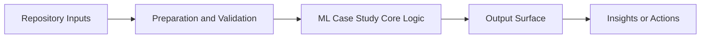
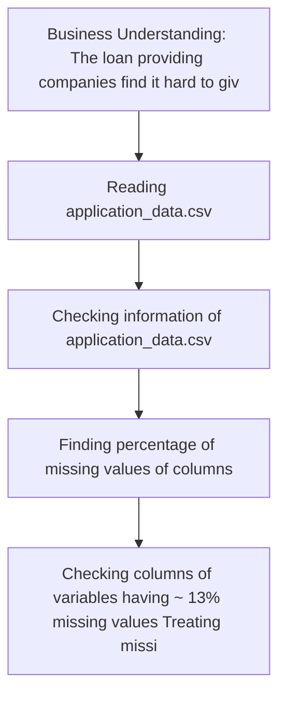

# Predicting Loan Defaulters to Reduce NPA Diagrams

Generated on 2026-04-26T04:17:39Z from repository evidence.

## Architecture Overview

```mermaid
flowchart LR
    A[Repository Inputs] --> B[Preparation and Validation]
    B --> C[ML Case Study Core Logic]
    C --> D[Output Surface]
    D --> E[Insights or Actions]
```

## Workflow Sequence

```mermaid
flowchart TD
    S1["Business Understanding: The loan providing companies find it hard to giv"]
    S2["Reading application_data.csv"]
    S1 --> S2
    S3["Checking information of application_data.csv"]
    S2 --> S3
    S4["Finding percentage of missing values of columns"]
    S3 --> S4
    S5["Checking columns of variables having ~ 13% missing values Treating missi"]
    S4 --> S5
```
